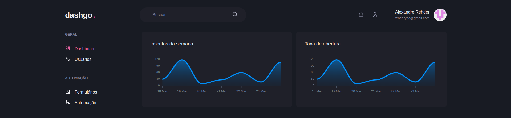

<h4 align="center"> 
	🚧 Dashgo in progress 🚧
</h4>

<p align="center">
     
    
</p>
    
## 💻 Sobre o projeto 

💡 Dashgo -

## 💻 Interface Web
<p align="center">
    
</p>

## 🛠 Tecnologias

As seguintes ferramentas foram usadas na construção do projeto:

- Next.js
- TypeScript
- SCSS
- Chakra UI

## Pré-requisitos

Antes de começar, é preciso ter instalado em sua máquina as seguintes ferramentas:

- Git
- Yarn

## 🚀 Como executar o projeto

```bash
# Clone este repositório
$ git clone https://github.com/Alexandrerehder/dashgo

# Acesse a pasta do projeto, instale as dependências e inicie a aplicação
$ cd dashgo && yarn && yarn dev

# A aplicação web inciará na porta:3000 - acesse http://localhost:3000
```
